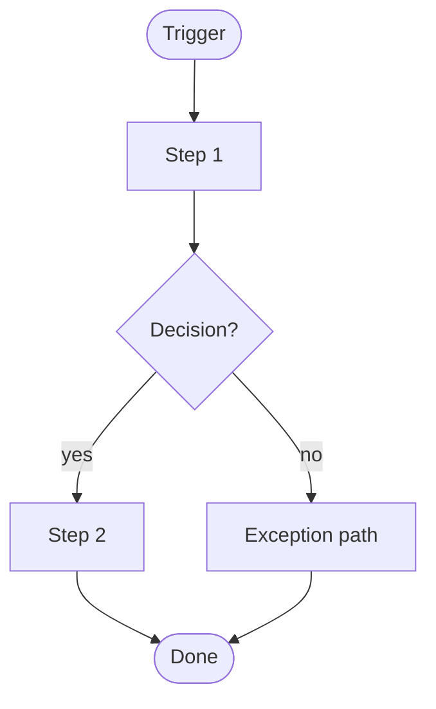

# Process Doc — <Title: "How to …">

<!--
Fill this in from your question-bank answers. Keep the main path scannable;
push rare edge-cases to the Appendix. Replace angle-bracket placeholders.
-->

**Owner (role):** <who owns this doc>
**Last reviewed:** <YYYY-MM-DD> · **Next review / review trigger:** <date or "when X changes">
**Audience:** <who this is for>
**Cadence:** <how often / when this runs> · **Typical duration:** <rough>

---

## 1. Purpose & scope
One to three sentences: what this process/methodology is and why it exists.

**In scope:** …
**Out of scope:** … (prevents "where does it end?" confusion)

## 2. Boundaries (SIPOC)

| Suppliers | Inputs | Process (high level) | Outputs | Customers |
|---|---|---|---|---|
| … | … | … | … | … |

- **Trigger (starts when):** …
- **End-state (done when):** …

## 3. The work

<!-- Use 3a for a PROCESS, 3b for a METHODOLOGY. For a HYBRID (both), keep both sections. Otherwise delete the one you don't use. -->

### 3a. Steps (process)
Write each step in second person ("You …"), role titles not names.

1. **<Step name>** — *Trigger:* … · *Who (role):* … · *Tools/links:* … · *Input → Output:* … · *~Time:* …
   - What to do: …
2. **<Step name>** …
3. …

#### Decision points & exceptions
| At step | If / when | Then |
|---|---|---|
| … | … | … |
| … | needs approval from <role> | … |

### 3b. Principles, gates & rituals (methodology)
- **Core principles:** …
- **Decision gates / criteria (DoR / DoD / release criteria):** …
- **Decision rights (RACI-lite):** A=…, R=…, C=…, I=…
- **Rituals:** <name> — purpose / frequency / owner
- **Tooling conventions:** …
- **Anti-patterns (what "wrong" looks like):** …

## 4. Controls & Definition of Done
- **Definition of Done (whole thing):** ☐ … ☐ … ☐ …
- **Checkpoints / gates:** <review/test/approval> — fails → <action>
- **Known failure modes & fixes:** … → …

## 5. Flowchart (optional)

## 6. Appendix
- Rare edge cases, historical context, links to related docs/SOPs, glossary of terms.
